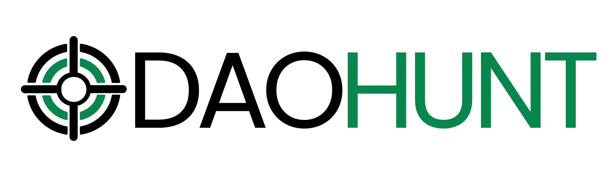
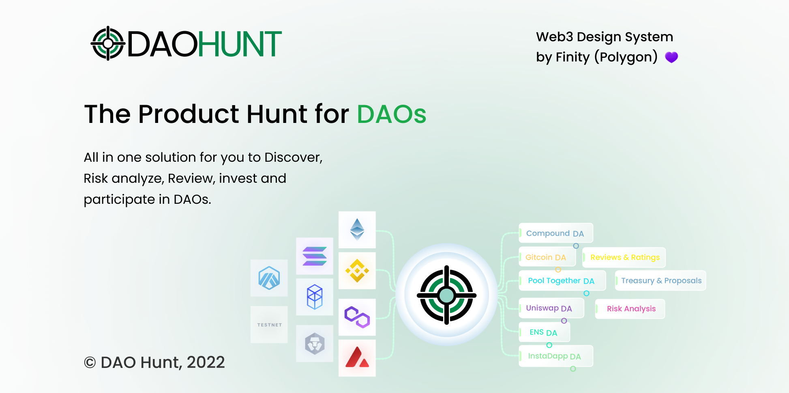

# Description
The Product Hunt for DAOs
- All in one solution for you to Discover, Risk analyze, Review, invest and participate in DAOs.

# What we use and SOLUTIONS
- All in one solution for you to Discover, Risk analyze, Review, invest and participate in DAOs.

-Using DAOHunt investor , developer and DAO community easily discover
DAO. Also then also review each and they see current proposal and also
providing base base version of risk analysis.

DAOHunt discover, review and rating is blockchain-based reputation infrastructure offers a transparent, verifiable, and bottoms-up discovery, review, and rating to all the online DAO with a widening user base that is not closeted in silos.

Following thing you can
 
 - List of DAO of multichain DAO
 - Search and Filter DAO
 - Review price Chart
 - See proposal of DAO
 - Risk anaysis
 - DAO grade system
 - DAO tool List
 - Earn and Learn (how you can earn crypto in part of different DAO)  [coming soon]
 - User profile user balance multichain balance token, NFT list of 


 The current reputation system is dependent on centralized players which makes it more prone to manipulation. DAO we strive to build a decentralized and open reputation utility service, which is not limited to a DAO or entity or service or product but rather which encompasses all of the above.

Incentivizing Act of Rating
Our platform aligns the users with DAO by giving them skin in the game via rewarding every Act-of-Rating (AOR). A user remains protected by anonymity by the protocol whatever rating output may be.


## Accomplishments that we're proud of
Loved the MVP we built DAO base verision ready.
 This Hackathon gave us a very good opportunity to showcase the work we did among an active community of the Web3 ecosystem.


# How we built it

## Polygon 
- All Contract  are deploy polygon testnet currently


- Minting DAOs
https://mumbai.polygonscan.com/tx/0x32a0945c34546030cc6573ff42f877ad1d35b5c0271b677096e4974cd5bb4055

- Upvoting
https://mumbai.polygonscan.com/tx/0x32a0945c34546030cc6573ff42f877ad1d35b5c0271b677096e4974cd5bb4055

## Polygon Finity Design System in a Dapp
- We have Polygon Finity Design in our following figam file that you check.

- https://www.figma.com/file/CW1b09cdQbj8MTPWfd6Z5R/Dao-Hunt-Finity-Design-System


## ChainLink Price feed:
- User come platform and review different DAO and what DAO like he vote that DAO for update he need to pay nominal fee  that we $ and in return they will get ERC1155 NFT. for polygon to usdt price we are using chainlink price feed

chainlink price feed: https://github.com/daohuntapp/contract/blob/master/contracts/DAOHuntERC721.sol
```
import "@chainlink/contracts/src/v0.8/interfaces/AggregatorV3Interface.sol";
import "./UpvoteERC1155.sol";

contract DAOHuntERC721 is ERC721, Ownable {
    uint256 public tokenIdCounter;

    UpvoteERC1155 public upvoteNFT;

    constructor(
        address _upvoteNFT,
        address _priceFeed,
        uint256 _feedDecimals,
        uint256 _usdUpvotePriceInWei,
        address _treasury
    ) ERC721("DAOHunt", "DHNT") {
        upvoteNFT = UpvoteERC1155(_upvoteNFT);
        priceFeed = AggregatorV3Interface(_priceFeed);
        feedDecimals = _feedDecimals;
        usdUpvotePriceInWei = _usdUpvotePriceInWei;
        treasury = _treasury;
    }
```

https://github.com/daohuntapp/contract/blob/master/deploy/001_deploy.ts

https://github.com/daohuntapp/contract/blob/master/networkVariables.ts


## Covalent: 
- Using covalent api for fetch data that used to track User balance
user NFT balance


```
async function fetchPools(chainId, dexName) {
return request(
    "GET",
    "https://api.covalenthq.com/v1/${chainId}/xy=k/${dexName}/pools/?quote-currency=USD&format=JSON&key=${API_KEY}"
  );
} 	
```


```
async function fetchPools(chainId, dexName) {
return request(
    "GET",
    "https://api.covalenthq.com/v1/${chainId}/xy=k/${dexName}/pools/?quote-currency=USD&format=JSON&key=${API_KEY}"
  );
} 	
```


## File Coin/IPFS

- Each DAO have there unique ERC721 NFT on DAUHunt. each data data we are storing IFPS 
   -  https://gateway.pinata.cloud/ipfs/QmX4dzq7LYLZVY5BwtKVqrdA9g6Juw8Mr5ENf6yof2kii3/1.json

- Minting DAOs
https://mumbai.polygonscan.com/tx/0x32a0945c34546030cc6573ff42f877ad1d35b5c0271b677096e4974cd5bb4055

- Upvoting
https://mumbai.polygonscan.com/tx/0x32a0945c34546030cc6573ff42f877ad1d35b5c0271b677096e4974cd5bb4055


